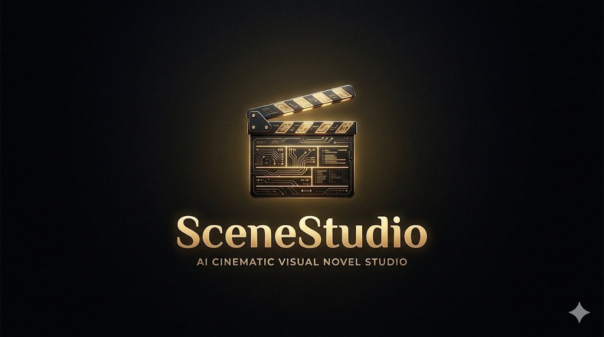
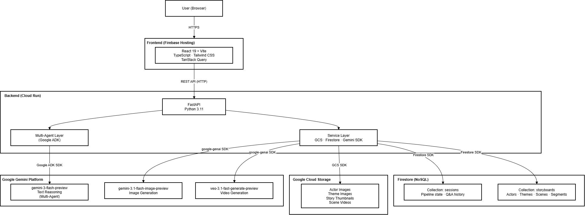
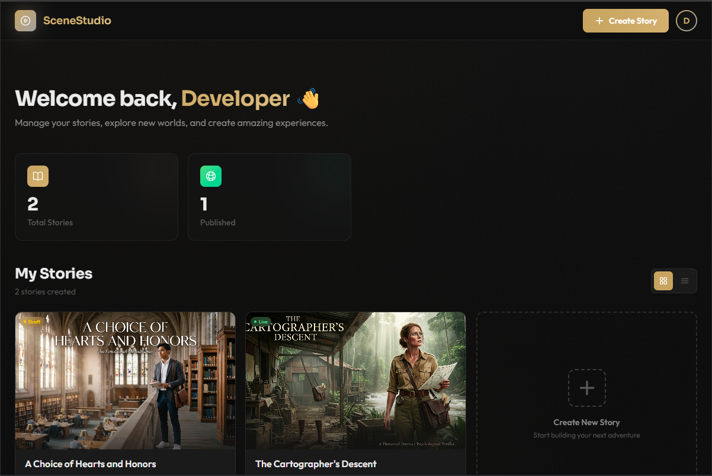
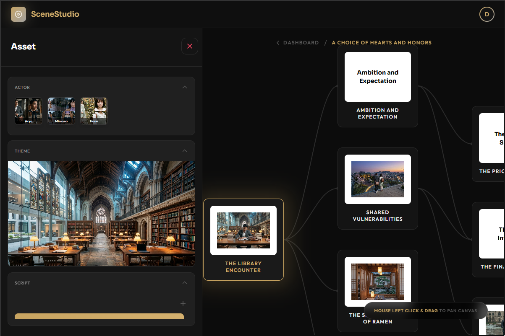
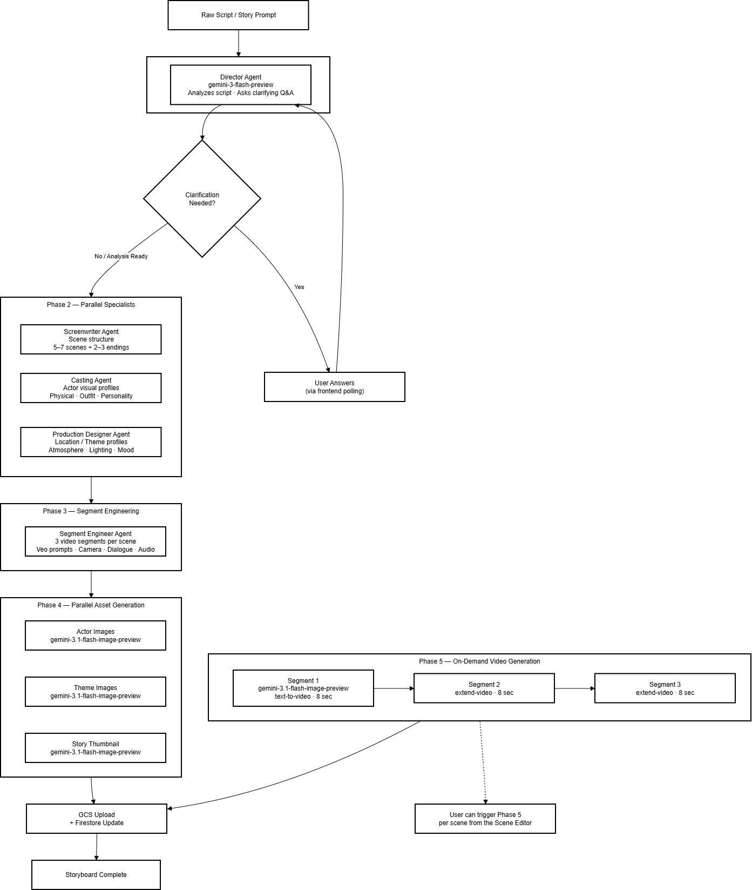
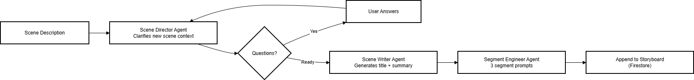

# SceneStudio



> AI-powered cinematic visual novel studio — build interactive stories with AI-generated scripts, character art, and cinematic video scenes.

Demo : https://www.youtube.com/watch?v=WtlUJYufBNU

Web URI (Read-only, we hide all the feature related to generation features because haven't setup for input api key) : https://asas-demo.web.app

**Gemini Hackathon — Creative Storyteller**



---

## Overview

SceneStudio is a creative platform that allows anyone to build cinematic visual novel experiences using AI-generated assets. Instead of manually creating scripts, artwork, and animations, creators describe their story and the system generates complete scenes combining narrative text, character portraits, location art, and video.

Inspired by game creation platforms like **Roblox Studio** and **visual novel engines**, SceneStudio dramatically lowers the barrier to producing narrative-driven interactive games. Creators define characters, themes, and story ideas — the AI handles the rest.

The platform uses **Gemini's multimodal capabilities** through a multi-agent pipeline: specialized AI agents collaboratively produce structured story scenes rather than isolated AI responses. Video scenes are built from three sequential 8-second Veo segments with video extension, giving each scene a cinematic ~24-second runtime.

| Dashboard | Scene Editor |
|-----------|--------------|
|  |  |

---

## Features

- **Multi-agent AI pipeline** — 7 specialized Google ADK agents (Director, Screenwriter, Casting, Production Designer, Segment Engineer, Scene Director, Scene Writer) collaborate to produce a complete storyboard
- **Interactive story refinement** — the Director Agent asks clarifying questions before production begins, so your vision is captured precisely
- **AI-generated characters & locations** — portrait images for all actors and concept art for all locations, generated with Gemini Image or Apixo
- **Cinematic video generation** — each scene is composed of 3 × 8-second Veo video segments with video extension, producing ~24 seconds of cinematic content per scene
- **Reference-based visual consistency** — actor and theme images are passed as ingredient references to Veo to maintain character/location consistency across scenes
- **Branching narrative** — scenes connect via choices, enabling interactive visual-novel-style gameplay
- **Dynamic scene addition** — add new scenes to an existing storyboard at any time via a dedicated sub-pipeline
- **Visual storyboard editor** — interactive canvas with pan/zoom, scene nodes, and a collapsible asset sidebar

---

## Tech Stack

### Frontend
| Technology | Version | Purpose |
|-----------|---------|---------|
| React | 19 | UI framework |
| TypeScript | 5.9 | Type safety |
| Vite | 7 | Build tool |
| TailwindCSS | 4 | Styling |
| TanStack React Query | 5 | Server state & polling |
| React Router DOM | 7 | Client-side routing |
| Axios | 1.13 | HTTP client |

### Backend
| Technology | Purpose |
|-----------|---------|
| Python 3.11 | Runtime |
| FastAPI | REST API framework |
| Uvicorn | ASGI server |
| Google ADK (`google-adk`) | Multi-agent orchestration |
| `google-genai` SDK | Gemini + Veo API calls |
| Pydantic | Data validation & models |
| PyAV (`av`) | Video frame extraction |
| FFmpeg | Video segment merging |
| Pillow | Image processing |
| `httpx` | Async HTTP client |

### AI Models (Google Gemini)
| Model | Role |
|-------|------|
| `gemini-3-flash-preview` | Text reasoning — all 7 ADK agents |
| `gemini-3.1-flash-image-preview` | Actor portraits + location images + thumbnails |
| `veo-3.1-fast-generate-preview` | Cinematic video generation |

### Google Cloud Infrastructure
| Service | Purpose |
|---------|---------|
| Firestore | NoSQL database — sessions + storyboards |
| Google Cloud Storage (GCS) | Actor/theme images, scene videos |
| Cloud Run | Backend container hosting |
| Firebase Hosting | Frontend CDN |
| Secret Manager | Service account credentials (production) |

---

## Project Structure

```
gemini-hackathon/
├── assets/                     # Screenshots and architecture diagrams
│
├── client/                     # React frontend (Vite + TypeScript)
│   └── src/
│       ├── api/                # Axios client, API service methods, TypeScript types
│       ├── components/         # Reusable UI components (modals, navbar, cards, overlays)
│       ├── hooks/              # Custom React Query hooks (pipeline, scene generation, storyboards)
│       └── pages/
│           ├── Dashboard.tsx   # Story listing and creation
│           └── SceneEditor.tsx # Interactive storyboard canvas + video generation
│
└── server/                     # Python FastAPI backend
    ├── agents/                 # 7 Google ADK LlmAgent implementations
    │   ├── director.py         # Phase 1: Script analysis + clarifying Q&A
    │   ├── screenwriter.py     # Phase 2: 5–7 scene structure with branching choices
    │   ├── casting.py          # Phase 2: Character visual profiles
    │   ├── production_designer.py  # Phase 2: Location/theme profiles
    │   ├── segment_engineer.py # Phase 3: 3 Veo segment prompts per scene
    │   ├── scene_director.py   # Add-scene sub-pipeline: Q&A for new scenes
    │   └── scene_writer.py     # Add-scene sub-pipeline: title + summary
    ├── api/
    │   ├── pipeline/           # End-to-end pipeline routes + orchestration service
    │   ├── story_board/        # Storyboard CRUD + add-scene sub-pipeline
    │   ├── scene/              # Video generation routes + Veo service
    │   ├── actor/              # Character management
    │   ├── theme/              # Location management
    │   ├── firestore/          # Firestore async service
    │   ├── gcs/                # Google Cloud Storage service
    │   └── apixo/              # Apixo fallback provider service
    ├── utils/
    │   └── merge_videos_ffmpeg.py  # FFmpeg video segment merging
    ├── models.py               # Pydantic data models (StoryBoard, Scene, Segment, Actor, Theme, …)
    ├── main.py                 # FastAPI app entry point
    ├── requirements.txt        # Python dependencies
    └── .env.example            # Environment variable template
```

---

## Running Locally

### Prerequisites

- **Node.js 18+** (or [Bun](https://bun.sh/))
- **Python 3.11+**
- **FFmpeg** — required for merging video segments
  - macOS: `brew install ffmpeg`
  - Ubuntu: `sudo apt install ffmpeg`
  - Windows: download from [ffmpeg.org](https://ffmpeg.org/download.html) and add to PATH
- A **Google Cloud Platform** account
- A **Gemini API key** from [Google AI Studio](https://aistudio.google.com/apikey)
- *(Optional)* An **Apixo API key** for the fallback video provider

---

### Step 1 — Clone the Repository

```bash
git clone https://github.com/bwbayu/SceneStudio.git
cd SceneStudio
```

---

### Step 2 — Google Cloud Setup

#### 2a. Create a GCP Project
1. Go to [console.cloud.google.com](https://console.cloud.google.com)
2. Create a new project (note the **Project ID**)

#### 2b. Enable Required APIs
In the GCP console, enable:
- **Cloud Firestore API**
- **Cloud Storage API**
- **Vertex AI API** (if using Veo via Vertex) — or ensure Gemini Developer API access

#### 2c. Create a Firestore Database
1. Navigate to **Firestore** in the GCP console
2. Click **Create Database**
3. Choose **Native mode**
4. Set a **Database ID** — you will set it in your `.env` file
5. Choose a region and click **Create**

#### 2d. Create a GCS Bucket
1. Navigate to **Cloud Storage** in the GCP console
2. Click **Create Bucket**
3. Choose a globally unique name (e.g., `scenestudio-assets-yourprojectid`)
4. Set **Access control** to **Fine-grained** and make objects publicly readable
   - Add an allUsers member with **Storage Object Viewer** role
5. Note the bucket name — you will set it in your `.env` file

#### 2e. Create a Service Account
1. Navigate to **IAM & Admin → Service Accounts**
2. Click **Create Service Account** with a descriptive name
3. Grant the following roles:
   - **Cloud Datastore User** (Firestore read/write)
   - **Storage Object Admin** (GCS upload/download)
4. Click **Done**, then open the service account
5. Go to **Keys → Add Key → Create new key → JSON**
6. Download the JSON file and place it at:
   ```
   server/keys/gemini-hackathon.json
   ```

---

### Step 3 — Backend Setup

```bash
cd server

# Create and activate a virtual environment
python -m venv env
source env/bin/activate       # macOS/Linux
# env\Scripts\activate        # Windows

# Install dependencies
pip install -r requirements.txt

# Configure environment variables
cp .env.example .env
```

Edit `server/.env` and fill in your keys:

```env
GEMINI_API_KEY=your_gemini_api_key_here
APIXO_API_KEY=your_apixo_api_key_here        # optional — required for Apixo video provider
GCS_BUCKET_NAME=your-gcs-bucket-name         # the bucket you created in step 2d
FIRESTORE_DATABASE=gemini-hackathon           # the Firestore database ID from step 2c
```

Start the backend server:

```bash
uvicorn main:app --reload --port 8000
```

The API will be available at `http://localhost:8000`. You can explore the interactive API docs at `http://localhost:8000/docs`.

---

### Step 4 — Frontend Setup

```bash
cd client

# Install dependencies
npm install
# or: bun install

# Start the development server
npm run dev
# or: bun dev
```

The frontend will be available at `http://localhost:5173`.

> The frontend is pre-configured to call the backend at `http://localhost:8000/api`. If you run the backend on a different port, update `client/src/api/axios.ts`.

---

## Reproducible Testing — For Judges

This section provides a step-by-step walkthrough to test all core features of SceneStudio.

### Setup Checklist
Before testing, verify:
- [ ] Backend running at `http://localhost:8000` (check `/health` → `{"status": "ok"}`)
- [ ] Frontend running at `http://localhost:5173`
- [ ] `server/.env` contains a valid `GEMINI_API_KEY`
- [ ] `server/keys/gemini-hackathon.json` exists with valid GCP credentials
- [ ] Firestore database `gemini-hackathon` is accessible
- [ ] GCS bucket exists and `BUCKET_NAME` in `GCSService.py` matches

### Test 1 — Full Story Generation Pipeline

1. Open `http://localhost:5173` — you should see the **Dashboard**
2. Click **"Create New Story"**
3. Enter a story prompt. Try one of these:

   > *"A young detective named Mia investigates a mysterious disappearance in a foggy 1940s city. Her only clue is a pocket watch left at the scene."*

   > *"Two rival AI robots in a distant future must work together to save their colony ship from a rogue navigation system."*

4. Click **Submit**. The pipeline starts and you will be redirected.
5. The **Director Agent** will ask 2–4 clarifying questions about genre, tone, characters, or setting. Answer each one.
6. After answering, the pipeline continues through all phases:
   - `processing_agents` — Screenwriter, Casting, Production Designer run in parallel
   - `processing_assets` — Segment Engineer creates video prompts
   - `generating_images` — Character and location images are generated
   - `storyboard_complete` — Full storyboard is ready
7. You will be navigated to the **Scene Editor** automatically.

### Test 2 — Scene Editor & Storyboard Review

1. In the Scene Editor, explore the interactive canvas:
   - Pan by clicking and dragging the background
   - Zoom with the scroll wheel
   - Click a scene node to select it
2. Open the **Assets** sidebar (left panel) to see:
   - **Actors** — AI-generated character portraits with names and descriptions
   - **Themes** — AI-generated location images
   - **Script** — Scene summaries and choice connections
3. Click any scene card to preview its thumbnail and summary.

### Test 3 — Video Generation

1. In the Scene Editor, click on any scene
2. Click **"Generate Video"**
3. Select a video provider:
   - **Gemini (Veo)** — uses Google's Veo 3 model directly (requires Veo API access)
   - **Apixo** — fallback provider (requires Apixo API key)
4. Video generation takes **5–15 minutes** per scene (Veo polls for completion)
5. Once complete, the scene card updates with a video thumbnail
6. Click the scene card again and click **Play** to watch the generated cinematic scene (~24 seconds: 3 × 8-second segments merged)

### Test 4 — Add Scene

1. In the Scene Editor, click **"Add Scene"**
2. Describe the new scene you want to add (e.g., *"A tense confrontation in the detective's office"*)
3. The **Scene Director Agent** may ask clarifying questions — answer them
4. After processing, the new scene appears on the storyboard canvas
5. Generate video for the new scene using Test 3 steps above

### Important Notes for Judges

> **Video generation rate limits**: Veo has a limited quota per day (typically 5–10 video generations). If you hit a quota error, either wait or switch to the Apixo provider.

> **Generation costs**: Veo video is billed per second of output. Each full scene (~24 seconds) costs approximately $1–3. We recommend testing with 1–2 scenes to control costs.

> **Image generation**: Gemini Image generation is fast (~5–10 seconds per image) and happens automatically as part of the pipeline. No additional action is needed.

> **Pipeline duration**: The full story generation pipeline (without video) takes approximately **2–5 minutes** depending on the number of scenes and API response times.

---

## Architecture

See [docs/architecture.md](docs/architecture.md) for a detailed breakdown including:
- Multi-agent pipeline diagram
- Video generation sequence
- Firestore document structure
- Frontend-backend API contract

### Main Generation Pipeline



### Add Scene Sub-Pipeline



---

## Inspiration

Our inspiration came from two worlds: **game creation platforms like Roblox Studio** and **narrative-driven visual novel engines**. Creating visual novels traditionally requires a large number of assets — artwork, scripts, animations — which can be extremely time-consuming and expensive.

We designed a system where anyone can become a storyteller without a full production team. Using Gemini's multimodal capabilities, the platform produces scenes where storytelling and visual elements are generated together, dramatically reducing the time and resources needed to produce visual storytelling content.

---

## How We Built It

SceneStudio is built on **Google Cloud and Gemini's multimodal capabilities**, combining several AI components into a structured creative pipeline:

1. **Multi-agent orchestration** — Different agents handle specific tasks (story generation, asset generation, scene assembly) producing structured outputs instead of isolated AI responses.

2. **Reference-based video generation** — Actor and location reference images are passed as ingredient inputs to Veo, maintaining visual consistency across scenes.

3. **Video extension** — Base video segments (~8 sec) are extended sequentially, producing longer cinematic sequences beyond the initial generation length.

4. **Gemini's interleaved multimodal output** — Text, visuals, and video are generated together as a cohesive storytelling experience.

---

## License

This project was built for the **Google Gemini Hackathon**.
