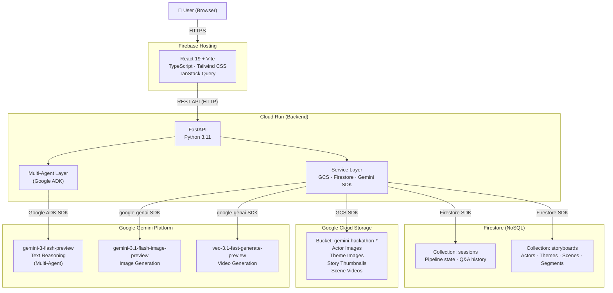
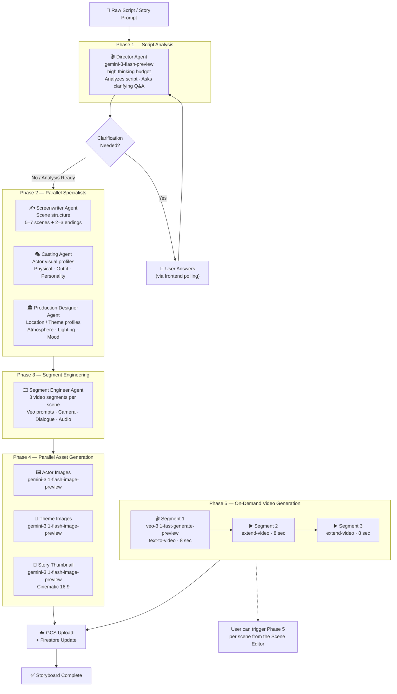
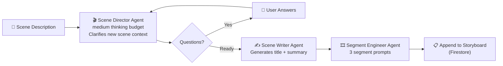
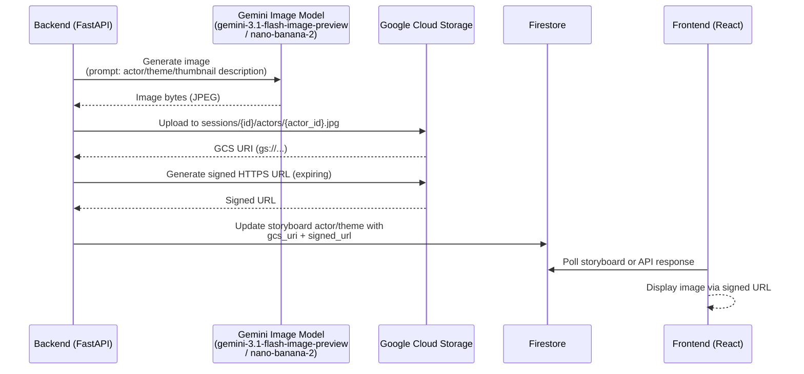
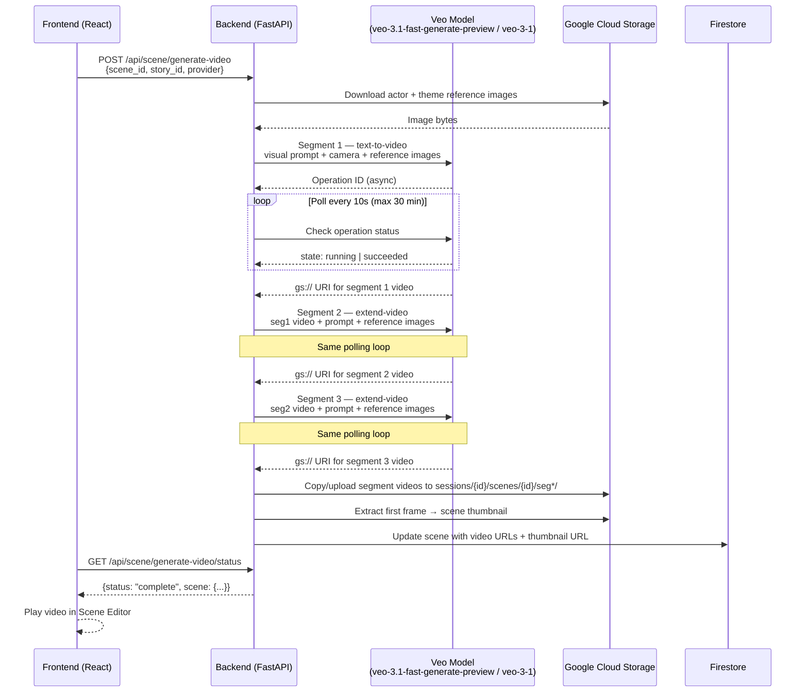
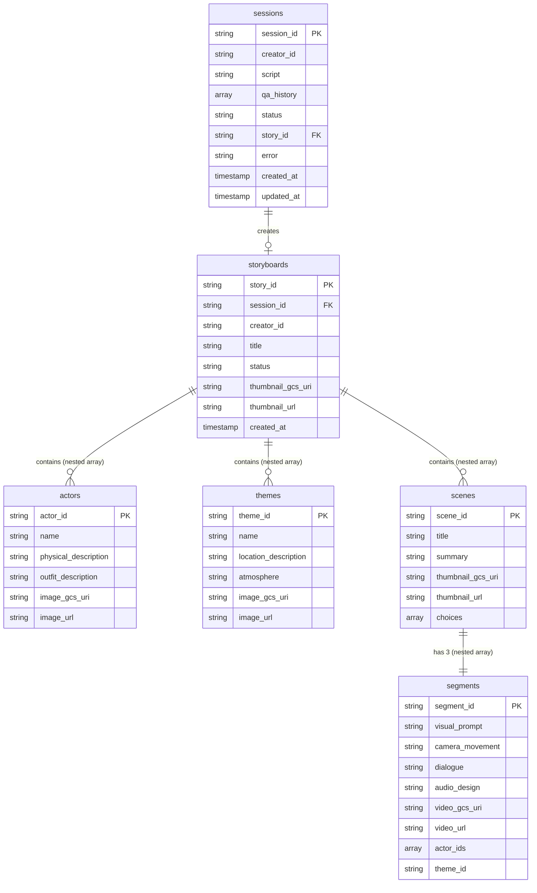
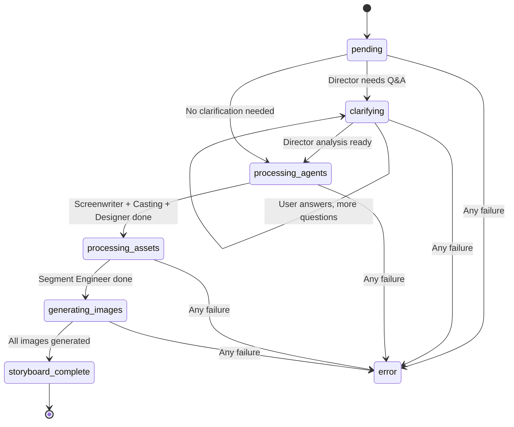
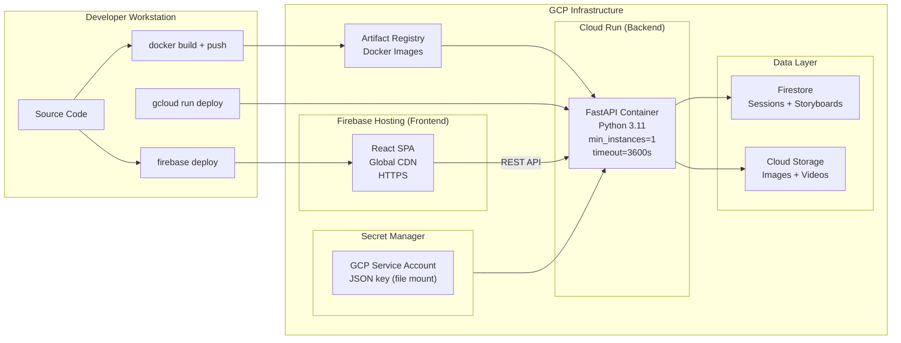
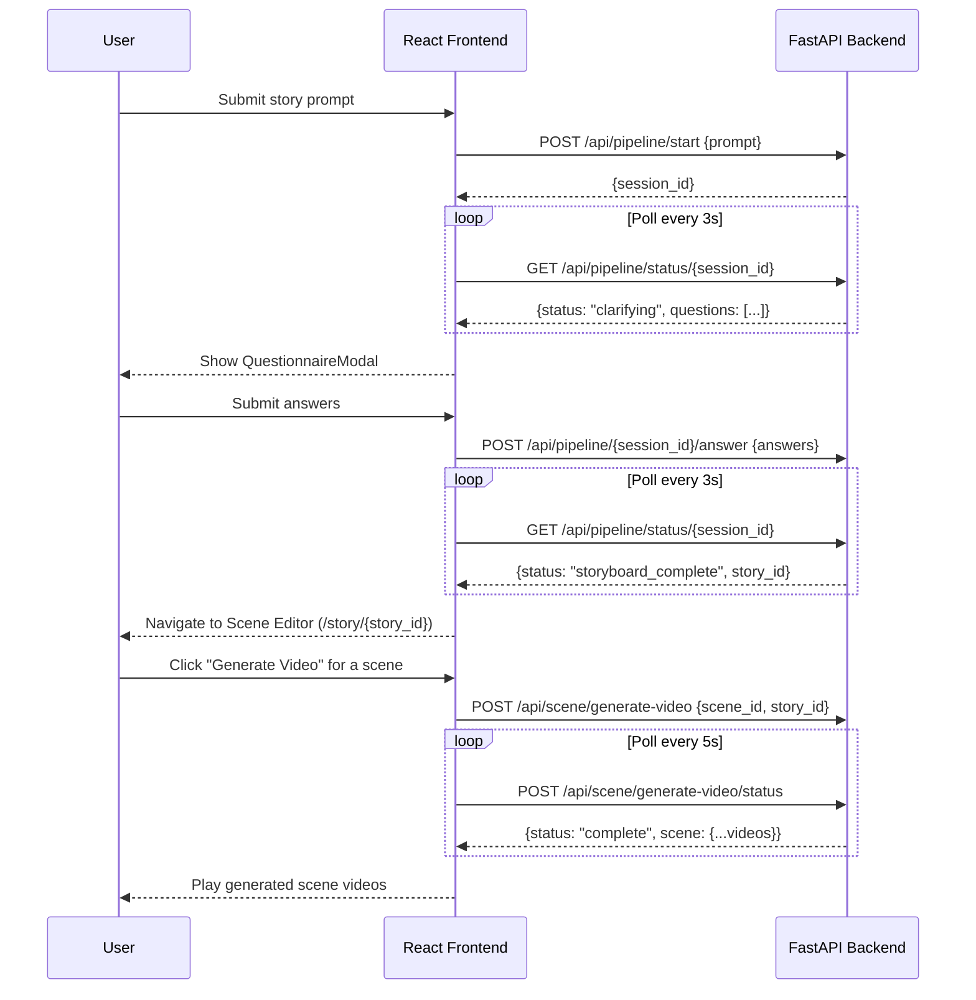

# SceneStudio — System Architecture

## Overview

SceneStudio is an AI-powered interactive FMV (Full Motion Video) storyboard generator. Users submit a script or story prompt; the system uses a multi-agent Gemini pipeline to produce a branching storyboard with AI-generated character images, location images, and video scenes.

- **Frontend**: React 19 + TypeScript + Vite, served via Firebase Hosting
- **Backend**: Python FastAPI, containerized and deployed on Cloud Run
- **AI Models**: Google Gemini Flash (text + image), Veo (video generation)
- **Agent Framework**: Google ADK (`google-adk`) with `LlmAgent` + `Runner`
- **Database**: Firestore (session state + storyboard content)
- **Asset Storage**: Google Cloud Storage (images + videos)
- **Deployment**: Manual CLI — `gcloud run deploy` (Cloud Run) + `firebase deploy` (Firebase Hosting)

---

## 1. High-Level System Architecture



---

## 2. Multi-Agent Pipeline

The backend uses **Google ADK** to orchestrate 7 specialized `LlmAgent` instances, all powered by `gemini-3-flash-preview`. Agents run sequentially or in parallel depending on their data dependencies.



### Add-Scene Sub-Pipeline

When a user adds a new scene to an existing storyboard, a shorter pipeline runs:



---

## 3. Image Generation Flow

Actor portraits, location images, and the story thumbnail are all generated by Gemini's image model (or nano-banana-2 via the same API surface), then stored in GCS with signed URLs served to the frontend.



**GCS Asset Paths:**
```
sessions/{session_id}/
  ├── thumbnail.jpg
  ├── actors/{actor_id}.jpg
  ├── themes/{theme_id}.jpg
  └── scenes/{scene_id}/
      ├── thumbnail.jpg
      ├── video.mp4          (merged)
      ├── seg1/video.mp4
      ├── seg2/video.mp4
      └── seg3/video.mp4
```

---

## 4. Video Generation Flow

Each scene is composed of 3 sequential 8-second video segments. Segment 1 is text-to-video; Segments 2 and 3 use extend-video from the previous segment. Up to 3 reference images (actors + theme) are passed to Veo for visual consistency.



---

## 5. Data Storage Layer

### Firestore Document Structure



> **Note:** In Firestore, `actors`, `themes`, `scenes`, and `segments` are stored as nested arrays within the `storyboards` document — not as separate collections.

### Session Status Lifecycle



---

## 6. Deployment Architecture



**Key Infrastructure Decisions:**
- **Cloud Run**: Serverless containers, `min-instances=1` to keep in-memory pipeline state alive, `timeout=3600s` to support Veo polling
- **Firebase Hosting**: CDN-backed static hosting for the React SPA
- **Secret Manager**: Service account JSON mounted as a file — never stored in the container image
- **Artifact Registry**: Private Docker registry in the same GCP project for fast pulls
- **No CI/CD**: Deployment is manual via `gcloud` and `firebase` CLI commands

---

## 7. Frontend–Backend API Contract

The frontend communicates exclusively via REST polling — no WebSockets. Long-running operations use a poll-until-complete pattern.



**Polling Intervals:**
| Operation | Interval | Max Wait |
|-----------|----------|----------|
| Pipeline status | 3 seconds | Until terminal state |
| Add-scene status | 3 seconds | Until terminal state |
| Video generation | 5 seconds | ~30 minutes (Veo timeout) |
| Image generation (Gemini) | Immediate (sync) | ~10 seconds |
